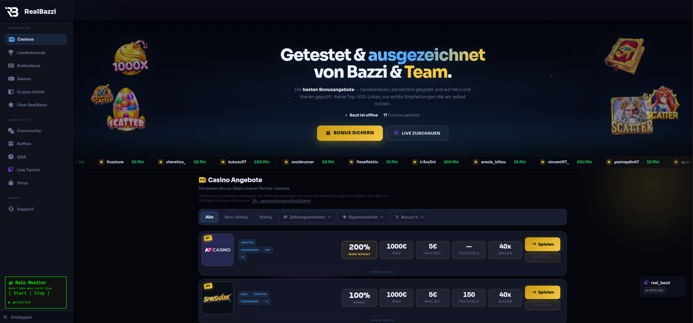

# Rain Monitor Chrome Extension

Ein Chrome Addon, dass den Punkte Rain auf https://realbazzi.com trackt und automatisch sammelt, wenn verfügbar.

## 🚀 Installation

1. Downloade das [letzte release](https://github.com/realbazzi/realbazzi/releases/tag/v2.2) oder klone die Repository und entpacke die *.zip Datei
2. Öffne Chrome und navigiere zu (gib das in der Suchleiste ein) `chrome://extensions/`
3. Aktivere den "Entwickler Modus" (Schalter oben rechts)
4. Klicke auf "Entpackte Erweiterung laden" (oben links) und wähle den entpackten Ordner
5. Das Addon taucht nun unten links auf https://realbazzi.com auf

## ✨ Features

- Trackt ob ein Punkte Rain aktiv ist
- Sammelt automatisch Punkte, wenn Rain aktiv
- Start/Stop Automatik
- Log System
- Keine nervige Benachrichtigung
- Funktioniert auch nach Reload der Seite (muss nicht neu gestartet werden)

## Nutzung

1. **Navigiere auf die Seite**
   - Addon wird automatisch geladen

3. **Rain Tracking**: 
   - Tracking wird automatisch gestartet (zu sehen unter F12 -> Konsole)
   - Stop pausiert das Monitoring, Start setzt es fort

4. **Logs**:
   - Logs werden ausgegeben und können gescrollt werden (maximal 30 Logs)
   - Können unter F12 -> Konsole eingesehen werden

## Wie es Funktioniert

- Funktionen werden geheim gehalten, damit sie nicht gefixed werden können

## Datenspeicherung

- **Lokaler Speicher**: Es wird nichts im lokalen Speicher gespeichert
- **Nur RAM-Speicher**: Logs werden im RAM gespeichert und verschwinden nach Reload (um Datenmüll zu vermeiden)

## Datenschutz und Sicherheit

- Alle Daten werden von der Seite direkt ausgelesen (so werden Leaks etc. vermieden)
- Addon sieht keine Cookies, Login Token oder andere sensitive Daten
- Kein extra Login notwendig, es wird nur der Login der Seite benutzt
- Es werden keine Daten vom Addon angelegt oder gespeichert
- Authentication Header werden vom Site-Request übernommen
- Es werden ausschließlich Anfragen an die Website selbst gesendet
- Die Daten des Nutzers werden gelöscht, sobald das Tracking beendet oder der Browser geschlossen wird
